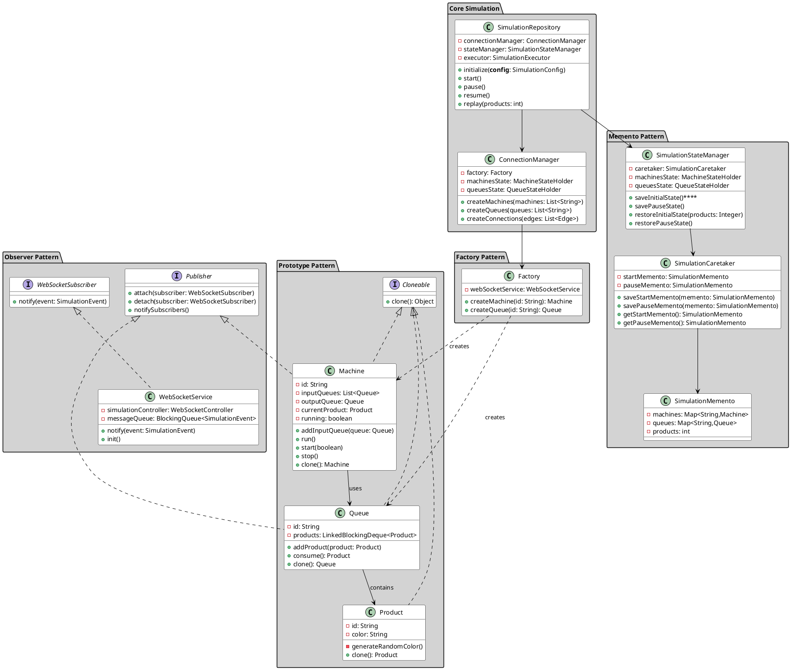

****# ThreadLine: Producer/Consumer Simulation System 🏭

<div align="center">


A real-time assembly line simulation system featuring multi-threaded processing, dynamic visualization, and interactive configuration.

[](https://www.oracle.com/java/)
[](https://spring.io/projects/spring-boot)
[](https://reactjs.org/)

[Demo Video](#-demo) | [Architecture](#-architecture)

</div>

## ✨ Features

- **Real-time Visualization** 🎯
  - Dynamic machine state updates
  - Live queue capacity monitoring
  - Product flow animation
  - Audio feedback for completed products

- **Interactive Configuration** 🛠
  - Drag-and-drop interface
  - Visual connection management
  - Real-time validation

- **Concurrent Processing** ⚡
  - Multi-threaded machine operations
  - Thread-safe queue management
  - Synchronized state handling

- **Simulation Controls** 🎮
  - Play/Pause functionality
  - State replay capability
  - Clear simulation option

## 🎥 Demo

<div align="center">
<video controls>
  <source src="./out/media/DEMO.mp4" type="video/mp4">
</video>
    <!--  -->
</div>


</div>

## 🏗 Architecture

### System Design (UML Class Diagram)

<details>
<summary>Click to expand UML Diagram</summary>



</details>

## 🛠 Tech Stack

### Backend
- Java 21
- Spring Boot
- WebSocket
- Lombok

### Frontend
- React.js
- React Flow
- StompJS
- Context API

## 🚀 Getting Started

### Prerequisites
```bash
java 21
maven
node.js
npm
```

### Installation

1. Clone the repository
```bash
git clone git@github.com:Michael23Magdy/ThreadLine.git
```

2. Backend Setup
```bash
# Switch to implementation branch
cd backend
mvn clean install
mvn spring-boot:run
```

3. Frontend Setup
```bash
# Switch to frontend branch
cd frontend
npm install
npm start
```

## 👥 Team

| Name            | Role                    |
| --------------- | ----------------------- |
| [Huthaifa Omar](https://github.com/HuzaifaOmar)   | Backend Development     |
| [Michael Magdy](https://github.com/Michael23Magdy)   | Frontend Development    |
